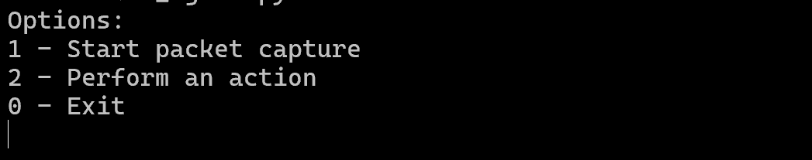
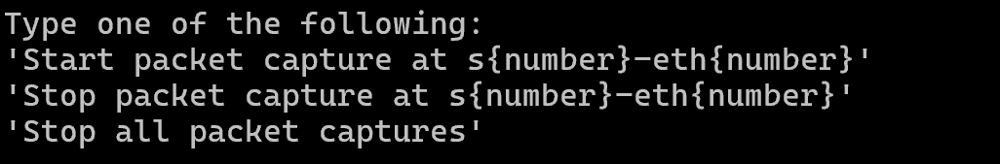

# Project Course

## Description

This project is a Python application that implements **intent-based networking** using a large language model (LLM). It integrates the LLM into the decision-making loop of an Software-Defined Network (SDN) by taking natural-language input from the operator and a snapshot of the current network state to propose and implement relevant changes in the network via the SDN controller. This project focuses on the addition of **ingress and egress filtering** in the SDN. The overall goal is to **simplify and automate network management**, so that humans can interact with the network using natural language, allowing for faster troubleshooting, safer action execution with confirmation, smarter decisions, and improved visibility and control in dynamic SDN environments.

## Key Components

#### **Dynamic Network State Retrieval**
Gathers real-time data about the network from the SDN controller, including MAC tables, port statistics, stop port states, flow tables, host-to-switch mappings, and implemented secuity policy rules. This maintains an up-to-date snapshot view of the network state for monitoring and decision-making. 

#### **LLM-Powered Network Diagnostics**
Uses OpenAI GPT-4o-mini to analyze the current network status and determine changes to security policies. The LLM outputs new proposed network security policies as a JSON object (e.g. allow, deny, whitelist, and SAV actions) that the SDN controller can directly implement in the network.

#### **Intent-Based Inference**
Converts natural-language intents into SDN controller–compatible actions for ingress and egress filtering. 
Translates user input like, “Block outbound HTTPS from h5” into precise OpenFlow matches (CIDRs, protocols, and ports) aligned with the current network state and the desired end-state.

#### **Controller-Side Action Implementation**
Executes LLM-generated actions directly on the controller using OpenFlow 1.3. Security rules are implemented as a three-table pipeline, in which:
- Table 0: Security policies, including ingress and egress rules, and HTTPS whitelists
- Table 1: Source Address Validation for anti-spoofing
- Table 2: Standard L2 forwarding for MAC learning

#### **PCAP traces**
To audit and validate actions as well as debug potential issues, the `PacketManager` enables on-demand packet captures using `tcpdump` at chosen switch interfaces. The captures are saved with metadata as `.pcap`files in the `pcap_traces/` folder, which can then be viewed and inspected using Wireshark.

## Features for Ingress & Egress Filtering
- **Inbound Service Blocking / Unblocking** 

    *What?* Ingress rules for TCP, UDP, and ICMP.

    *Why?* Provides fine-grained control over which services are allowed to enter the network. It is an important safeguard against malware attacks. Additionally, it enforces policy compliance and allows for safer diagnostics. 

- **Outbound Service Blokcing / Unblocking** 

    *What?* Egress rules for TCP, UDP, and ICMP.

    *Why?* Provides fine-grained control over which services are allowed to leave the network. It is an important safeguard against malware attacks. Additionally, it enforces policy compliance and allows for safer diagnostics. 

- **Source Address Validation (SAV)** 

    *What?* Prevents IP spoofing by binding (IP, MAC, port). 

    *Why?* Prevents IP/MAC spoofing attacks inside the network, as it ensures that hosts are not able to impersonate others. 

- **Whitelisting HTTPS destinations** 

    *What?* All HTTPS is denied in the network by default. User can sleectively whitelist HTTPS destinations. 

    *Why?* HTTPS traffic is encrypted and can hide or disguise malicious traffic in the network. Therefore, enforcing a zero-trust policy for encrypted traffic improves security, as it only allows whitelisted (approved) hosts to be accessed, reducing the attack surface.

## How Does It Work?
- **Main menu:** The user is first prompted to choose one of the following options:

    1. *Start / Stop PCAP traces:* The user is asked to either start a packet capture at a specific interface of a switch of their choice, stop a packet capture using the capture ID, or stop all active packet captures. 
    2. *Perform an action:* The user is prompted to ask the LLM to perform an action (this part is similar to that of the previous project).
    0. *Exit the program:* The program will shut down. 

- **Option 1: PCAP Traces**
    - Start a capture by typing, "Start packet capture at sX-ethY" (e.g., s2-eth1). The agent will start a `tcpdump` on that interface and prints a unique capture ID. Files will be saved as timestamped `.pcap` in the folder `pcap_traces/` and can be opened in Wireshark. You can run multiple captures can run concurrently.
    - Stop a single capture with "Stop capture with ID <capture_id>".
    - Stop all by writing the command, "Stop all packet captures". 

- **Option 2: Action Implementation**
    - **Network state retrieval:** When the user requests an action, the current state of the network is retrieved for analysis. A JSON object containing the switches, MAC tables, port statistics, port descriptions, stp port states, flow tables, host-to-switch mappings, and existing security policies is retrieved and sent to the LLM for analysis along with the query.
    - **Network topology retrieval:** Similarly to the network state, the network topology, consisting of a static JSON file, is retreived, parsed, and also sent to the LLM along with the query as contextual information.
    - **Recommendation and decision-making:** The user intent, network state and topology data, and the general rules of SDN controller operations are combined to query for a formal diagnosis and recommendation for actionable steps to take to confirm or solve the problem.
    - **Action implementation:**  If actionable steps are suggested, the network engineer can review the recommendation and allow or deny the actions. If the actions are denied, the agent will return to wait for a new user input. If the user accepts the actions, they will be implemented in the SDN controller directly. 
- **Logging:** 
    - **Network state:** The network state snapshots are stored in the `logs/` folder by `timestamp.json` for future monitoring and improvement. 
    - **Packet captures:** Network traffic can be captured and audited at the selected switch interfaces. The captures are automatically saved as `.pcap` files in the `pcap_traces/` folder when ended. These captures serve as a packet-level audit trail to validate effects of policies, support troubleshooting, and guide new ingress and egress rules. Captures can be opened in Wireshark.

## Requirements, Installation & Running the App

### Requirements
The application requires **Mininet** and runs on **Python3** (Python 3.8.0 was used in development) 
Required libraries include: 
- openai v.1.97.1
- python-dotenv v.1.0.1
- requests v.2.32.4
- ryu v.4.34
- mininet v.2.3.0.dev6

The Python library requirements are also available in the `requirements.txt` file in the repository root folder. 

### Installation
1. Clone the repository in your local machine as follows: 
`git clone https://github.com/wannalina/project-course.git`
2. Install the dependencies: 
`pip install -r requirements.txt`
3. Ensure that Mininet is up and running

### Running the App

1. **Start**

    Move yourself to a separated environment, like comnetsemu.

2. **Mininet and topology initialization:** 

    Use the following command: 
    `sudo python3 mininet/topology.py`
    This will initialize the Mininet network simulation, start the RYU controller, and build the static topology consisting of four switches and six hosts, with the links formed as follows: 
    
    

    Once the controller has finished initializing, test it using the `pingall` command to verify that all hosts can reach each other.

3. **Initialize the main application**

    Use the following command to initialize the program: 
    `sudo python3 northbound_agent.py`

4. **Talk with the Northbound Agent**

    Observe that the command line interface of `northbound_agent.py`, the program asks for user input (intent) as follows: 
    

    Below is a walk-through of each option and its expected output.

    - **Option 1: Start / stop packet captures:**
    After selecting option 1, a new menu opens up as follows: 
    
    To start a packet capture at a specific interface of a switch, you must type, "Start packet capture at s1-eth1", for instance. This will begin capturing packets at interface eth1 of switch 1 until it is manually stopped by selecting option 1 again in the main menu and selecting the option "Stop packet capture at {capture ID}" or "Stop all packet captures". Keep in mind that when starting a packet capture, you will receive the capture ID on the command line after the capture starts successfully. This will be needed when stopping a single packet capture as there may be several packet captures at different switches / interfaces active at once, so it is a good idea to write it down.

    - **Option 2: Perform an action:**
    After selecting option 2, the program will prompt the user to enter an action to implement in the controller. As this project focuses on ingress and egress filtering, example actions to implement could include the following:
        - **Block / unblock inbound services:** "Block HTTP traffic to h5."
        - **Block / unblock outbound services:** "Block ICMP traffic from h1.""
        - **Implement Source Address Validation (SAV) as an anti-spoofing measure:** "Implement SAV in the network."
        - **Whitelist HTTPS destinations:** "Whitelist HTTPS to destination h4."

    - **Option 0: Exit program**

5. **To test the action**, the user may perform a series of tests in the Mininet terminal window. However, the specific tests depend on the action implemented, so here are a couple of examples: 

    5.1. **To test a blocked inbound service: "Block HTTP traffic to h5"**

    First, open an xterm window for h5. in the h5 xterm window, type the command `python3 -m http.server 80 &` to set up a new HTTP server on the host.
    Then, open an xterm window for any of the other hosts, for example h2. In the xterm window of h2, execute the command `curl -m 3 -v http://10.0.0.5:80/`. The should result in no response as no connection can be established. 

    However, if you want to make sure that the HTTP connections work on other hosts as they should, you can test this HTTP connection by closing the current listener on h5. Because the implemented security rule should only block inbound HTTP connections to h5, we can create a HTTP server in the h2 xterm window using the same commmand as before: `python3 -m http.server 80 &`. After that, we can move to the h5 xterm window and execute the command: `curl -m 3 -v http://10.0.0.2:80/`. This should result in the request being seen in the xterm window of h2 with the status code 200. 

    5.2. **To test a blocked outbound service: "Block ICMP traffic from h1"**

    Because we are dealing with the ICMP protocol, we can simply test this using the `pingall` command to see which hosts are able to reach each other via ping. According to the resulting pingall table, you should see that h1 is not able to contact any other host in the network, but all other hosts are able to contact h1 and each other. 

    Instead, if you do not want to wait for the `pingall` command to finish as it may take a long time, you may also ping a few hosts individually to compare their behavior. For instance, you may try to ping h4 from h3 using the command: `h3 ping -c 3 h4`. This should work. Then, ping h4 from h1 using: `h1 ping -c 3 h4`. This should not work as we have added a security rule to intercept outbound ICMP traffic from h1.

    5.3 **To test SAV: "Implement SAV in the network"** 

    First, to test that everything works correctly prior to spoofing IP addresses, perform a `pingall` to test that all hosts are able to reach each other. Once you have confirmed that it works, proceed to modify the IP address of h1 using the following commands in the Mininet terminal:

    `h1 ip addr flush dev h1-eth0`

    `h1 addr add 10.0.0.7/24 dev h1-eth0`

    `h1 ip link set h1-eth0 up`

    Next, perform another `pingall`, and you should notice that h1 is no longer able to reach any other host in the network as the IP address is spoofed. Additonally, you can see that no other host is able to reach h1 as h1 no longer has its original IP address. You may also see the SAV measure interceting packets in the SDN controller xterm window as it will display error messages notifying of SAV binding violations, for instance.

    5.4 **To test whitelisted HTTPS destinations: "Whitelist HTTPS to destination h4"**

    Open xterm windows for h3, h4, and h5. First, to show that HTTPS does not function where not whitelisted start a HTTPS server as follows: 

    `openssl req -x509 -newkey rsa:2048 -nodes -days 1 \
    -keyout key.pem -out cert.pem -subj "/CN=10.0.0.3"`

    `openssl s_server -accept 443 -www -cert cert.pem -key key.pem`
    
    Then in h5, make a request to the HTTPS server: `curl -vk https://10.0.0.3/`. Nothing should happen here as HTTPS has not been whitelisted to destination h3. 

    To test that HTTPS does work on the whitelisted destination, start a new server on h4: 

    `openssl req -x509 -newkey rsa:2048 -nodes -days 1 \
    -keyout key.pem -out cert.pem -subj "/CN=10.0.0.4"`

    Then in h5, make another query to the endpoint: `curl -vk https://10.0.0.4/`. This should output a HTML template with the status code 200.

6. **To exit the program**, stop the application by typing "0" on the `northbound_agent.py` main menu. Then stop the Mininet instance using the following command: 
`exit`
Finally, clear and clean up any leftover Mininet network states and processes using the command: 
`sudo mn -c`

## LLM Integration Specifics

### Choosing the model
For this project, we integrated the OpenAI GPT-4o-mini family using the OpenAI Python library. During development, several general-purpose models were compared (e.g., GPT-4o, GPT-4 Turbo variants, GPT-3.5) to balance structured output reliability, prompt complexity, latency, token limits, and cost.
GPT-4o-mini was chosen because it consistently produced well-formed JSON output objects, provided fast responses suitable for interactive operations, and provided a strong cost/performance trade-off due to its need to only utilize one query for each action instead of two (as was the case whe using Claude Sonnet 4).

### Building the prompt
The system prompt, found in `/lib/system_prompts.py` defines the LLM's behavior and the output format. The system prompt includes the following: 
1. **Role definition:** The LLM is given a set role, in this case a network policy decision engine, to constrain its behavior to be more deterministic and structured. 
2. **Output schema:** The LLM is asked to provide all responses following a specific OpenFlow -compatible JSON schema with no extra commentary. Two example JSON objects are given to provide further context for the desired output.
3. **Additional notes:** Additional notes are given at the end to provide further guidelines on SAV actions as this action is more complex and requires the LLM to do more inference on its own.

In addition to the system prompt, a user prompt is also constructed by the Northbound Agent and sent to the LLM. The user prompt consists of real-time contextual data, including: 
1. **User intent:** The user's natural language instruction, e.g. "Block all outbount ICMP traffic from h6."
2. **Network topology:** The network topology describing the switch-to-host connectivity in the network. 
3. **Current network state:** The current network state which is retrieved from the SDN controller via an API call to the `/intent/get-state` endpoint. 

### Prompt engineering process
The prompt engineering process of this project builds upon that of the previous project. For more information, please visit the [PatchHunter README file](https://github.com/wannalina/network-project). However, this project ultimately settled on a one-prompt strategy due to the change in LLM model from Claude Sonnet 4 to GPT-4o-mini as it is able to handle larger prompts (intent + topology.json + live controller state) in a single pass while still returning valid JSON.

## FAQ

#### What is included in the network snapshot?
Each network snapshot includes the following, aggregated from all active switches: a list of switch IDs, the MAC table (mac_to_port), the host table (per-MAC location), port statistics, port description stats, STP port states, and flow stats. Although more network components can be additionally measured, these components are specifically chosen as they provide a sufficient picture of the network while still considering the cost and accuracy trade-offs of passing large network state objects to an LLM model **(It is more useful to ask an LLM to interpret a short network snapshot even if it contains less data as it can easily get confused when overwhelmed with large data volumes)**. 
The currently provided data allows the LLM to determine the following: 
- **Switches:** Which datapaths are currently registered and available for actions.
- **MAC table:** Location of components in the network (hosts, switches, etc.) & detection of duplicate or flapping MAC addresses
- **Port stats:** Assists in congestion detection and packet loss discovery through per-port counters
- **Port description stats:** Administrative / operational state and attributes to spot down / misconfigured links
- **STP port states:** Whether a port is FORWARD / BLOCK / etc., to avoid suggesting flows on blocked paths.
- **Flow stats:** Installed matches / actions with packet / byte counts to find missing / incorrect rules.
- **Host table:** Direct host to switch / port mapping to trace paths and verify reachability.
- **Security rules:** Ingress and egress rules implemented in the network.

The data is kept up to date in the SDN controller by issuing Ryu OpenFlow `requests—parser.OFPPortStatsRequest()` for per-port counters, `parser.OFPPortDescStatsRequest()` for port attributes / state, and `parser.OFPFlowStatsRequest()` for installed flow entries.

#### Can PatchHunter modify the network automatically? 
Only with user confirmation. It is improtant that the network engineer first carefully reviews the agent's recommendations and proposed actions before permitting them. While Claude Sonnet 4 is powerful, it may misinterpret ambigious input or edge-case data, which is why all actions require careful review by the user and explicit confrimation before modifying the network state.

#### Can I see the effect of rules I apply?
Yes. You can use packet captures, available at `pcap_traces/` after ending the capture, to inspect traffic before and after applying rules. Alternaticely, you can also check the controller’s flow table using the command: `ovs-ofctl dump-flows` in the Mininet terminal.

#### How do I remove or revert a rule?
You can use the same natural language interface, for example:
- “Unblock inbound TCP to h5.”
- “Unblock outbound ICMP from h3.”

#### Does the controller need to be restarted when new rules are added or removed?
No, the controller updates flow tables dynamically in real-time using OpenFlow messages.

#### Why use an LLM for this instead of manual configuration?
Manual OpenFlow rule management is complex and prone to errors. The LLM allows translating high-level objectives into precise, low-level configurations automatically (intent-based networking) while still allowing human validation before applying actions.

#### Can this framework integrate with other controllers?
The logic is built around the Ryu API, but the northbound interface is modular. Therefore, it can be adapted to other SDN controllers, such as ONOS or Floodlight, with some adjustments to the API.
