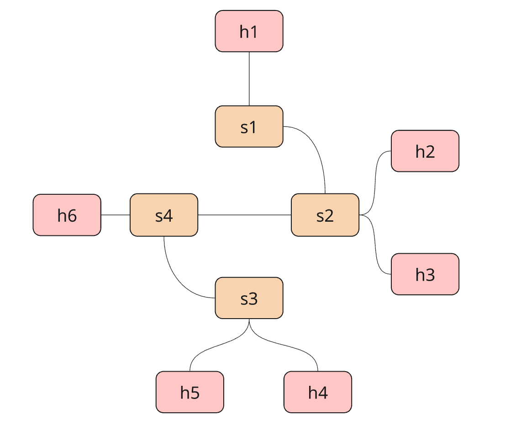

# Project Course

## Description

This project is a Python application that implements intent-based networking using a large language model (LLM). It integrates the LLM into the decision-making loop of an SDN network by taking natural-language input from the operator and a snapshot of the current network state to diagnose issues and to propose and implement changes in the SDN controller (e.g., ingress/egress filtering, flow updates, and port operations). The goal is to simplify and automate network management so humans can interact with the network using plain language—enabling faster troubleshooting, safer action execution with confirmation, smarter decisions, and improved visibility and control in dynamic SDN environments.

## Main Features

#### **Dynamic Network State Retrieval**
Gathers real-time data about the network from the SDN controller, including MAC tables, port statistics, stop port states, flow tables, host-to-switch mappings, and implemented secuity policy rules. This maintains an up-to-date snapshot view of the network state for monitoring and decision-making. 

#### **LLM-Powered Network Diagnostics**
Anomaly detection and response. Uses OpenAI GPT-4o-mini to analyze the current network status to determine changes to security policies, including tightening ingress rules and whitelisting services. 

#### **Intent-Based Inference**
Translates natural-language intents from the network engineer into SDN controller–compatible actions for ingress/egress filtering and related operations. For example, “Block outbound DNS from 10.0.0.0/24” or “Allow HTTPS only to 172.16.0.0/16” becomes precise OpenFlow matches (CIDRs, protocols, and ports) aligned with the current network state.

#### **Controller-Side Action Implementation**
Executes LLM-generated actions directly on the controller using OpenFlow 1.3. Security rules land in a two-table pipeline (table 0 = policy gate, table 1 = L2 forwarding): allow routes traffic via GotoTable(1), while deny drops it. Also supports port state changes, flow installation/removal, and status checks.

## How Does It Work?
- **Network state retrieval:** When the user has requested action, the current state of the network is retrieved for analysis. A JSON object containing the switches, MAC tables, port statistics, port descriptions, stp port states, flow tables, host-to-switch mappings, and existing security policies is retrieved and sent to the LLM for analysis in the first query.
- **Network topology retrieval:** Similarly to the network state data, the network topology, consisting of a static JSON file, is retreived, parsed, and also sent to the LLM along with the first query as contextual information.
- **Recommendation and decision-making:** The user intent, network state and topology data, and the general rules of SDN controller operations are combined to query for a formal diagnosis and recommendation for actionable steps to take to confirm or solve the problem.
- **Format validation:** A second query to the LLM is performed in order to ensure that the actionable output (a list of JSON objects) provided by the first query is precise and in the correct format. This is done to increase the consistency of the final LLM output and make sure that it can be understood and implemented by the SDN controller. It is an important step of the process as general-purpose LLMs, such as ChatGPT and Claude Sonnet, lack the specific fine-tuning for network management and may thus produce varying output, particularly when query prompts are large and contain larger quantities of necessary contextual data.
- **Action implementation:**  If actionable steps are suggested, the network engineer can review the recommendation and allow or deny the actions. If the actions are denied, the agent will return to wait for a new user input. If the user accepts the actions, they will be implemented in the SDN controller directly. 
- **Logging:** 
    - **Network state:** The network state snapshots are stored in the logs/ folder by timestamp.json for future monitoring and improvement. 
    - **Packet captures:** Representative traffic is recorded as packet capture files (.pcap/.pcapng) under logs/ (e.g., logs/<timestamp>.pcap). These captures serve as a packet-level audit trail to validate effects of policies, support troubleshooting, and guide new ingress/egress rules. Captures can be opened in Wireshark or inspected via tshark/tcpdump using display filters (e.g., tcp.port==443, dns, ip.addr==10.0.0.5). File rotation is configured to limit disk usage, and summaries/exports (CSV/JSON) can be generated for reporting.

## Requirements, Installation & Running the App

### Requirements
The application requires **Mininet** and runs on **Python3** (Python 3.8.0 was used in development) 
Required libraries include: 
- openai v.1.97.1
- python-dotenv v.1.0.1
- requests v.2.32.4
- ryu v.4.34
- mininet v.2.3.0.dev6

The Python library requirements are also available in the `requirements.txt` file in the repository root folder. 

### Installation
1. Clone the repository in your local machine as follows: 
`git clone https://github.com/wannalina/project-course.git`
2. Install the dependencies: 
`pip install -r requirements.txt`
3. Ensure that Mininet is up and running

### Running the App

1. **Start**
Move yourself to a separated environment, like comnetsemu.

2. **Mininet and topology initialization:** 
Use the following command: 
`sudo python3 mininet/topology.py`
This will initialize the Mininet network simulation, start the RYU controller, and build the static topology consisting of four switches and six hosts, with the links formed as follows: 

Once the controller has finished initializing, test it using the `pingall` command to verify that all hosts can reach each other.

3. **Initialize the main application**
Use the following command to initialize PatchHunter: 
`sudo python3 northbound_agent.py`

4. **Ask questions and perform actions**
Observe that the command line interface of `northbound_agent.py`, the program asks for user input (intent). 
On this command line, enter a question or a command, for example, "Please disable all ports on switch 1". 
Then, review the agent's repsonse. If the proposed action corresponds to what you want to achieve, reply "yes" to the agent to confirm and execute the action.

5. **Test the action**
!!

6. **To exit the program**, stop the PatchHunter application by typing "exit" on the `northbound_agent.py` command line interface. Then stop the Mininet instance using the following command: 
`exit`
Finally, clear and clean up any leftover Mininet network states and processes using the command: 
`sudo mn -c`

## LLM Integration Specifics

### Choosing the model
For this project, we integrated the OpenAI GPT-4o-mini family via the OpenAI Python SDK. During development, we compared several general-purpose models (e.g., GPT-4o, GPT-4 Turbo variants, GPT-3.5) to balance structured output reliability, prompt complexity, latency, token limits, and cost.
GPT-4o-mini was selected as the default because it consistently produced well-formed JSON (crucial for SDN controller compatibility), delivered fast responses suitable for interactive operations, and provided a strong cost/performance trade-off for iterative, human-in-the-loop workflows.

### Building the prompt

## FAQ

